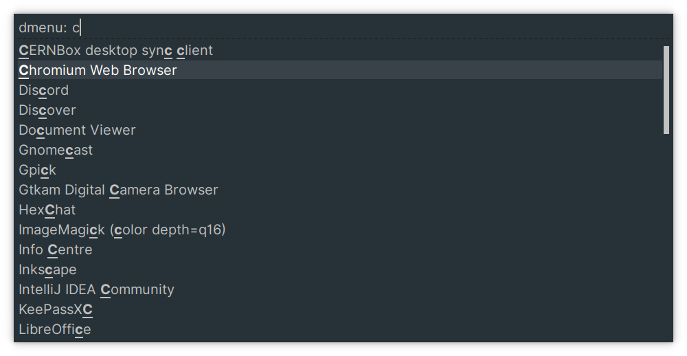
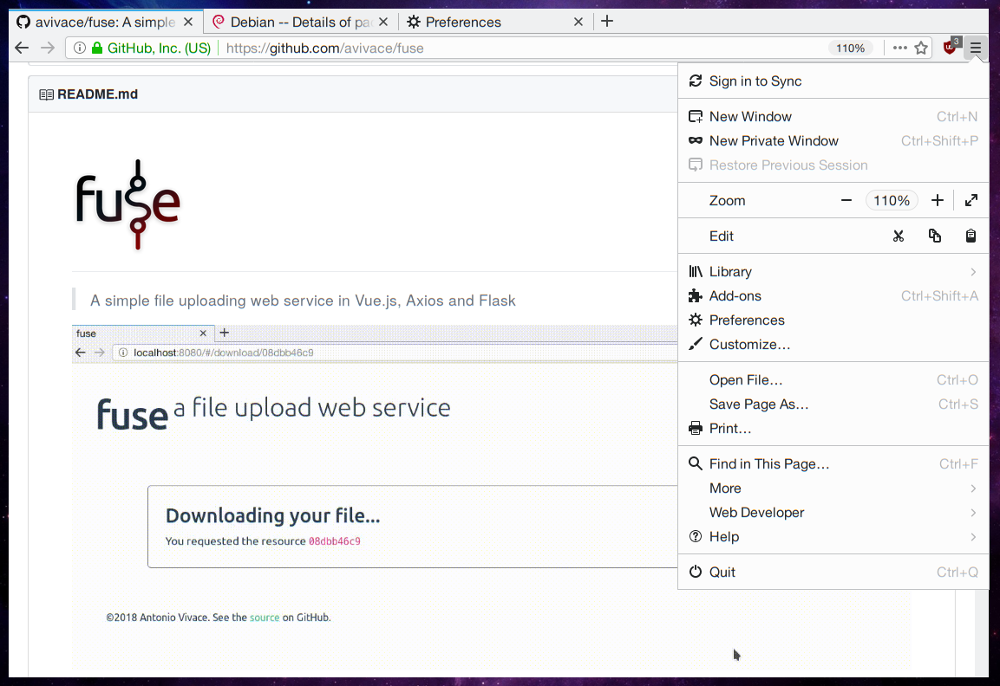

# dotfiles


[Full screenshots gallery](http://imgur.com/a/KzJZn)

### Contents

- [Introduction](#further-reference)
- [Login Manager](#login-manager)
- [Desktop](#desktop)
	+ [i3 + Plasma](#i3--plasma-integration)
	+ [Status Bar](#status-bar)
	+ [Launcher](#launcher)
	+ [Theming](#theming)
	+ [Typography](#typography)
	+ [Compositor](#compositor)
	+ [Notifications](#notifications)
- [Applications](#applications)
	+ [Terminal Emulator](#terminal-emulator) (Alacritty)
		* [Color Scheme](#color-scheme)
	+ [Shell](#fish) (fish)
	+ [Browser](#firefox) (Firefox)
	+ [Text Editor](#sublime-text) (Sublime Text)
- [System](#system)
- [Scripts](#scripts)
- [Credits](#credits)

___

## Introduction

Each folder is named after a package and contains every configuration file used by that application.
Besides some noted exceptions, the files inside the folders are relative to home (e.g. the file `vim/.vimrc` goes to `~/.vimrc`).

Every section here explains which settings and (if any) workarounds/fixes are used to obtain the described result.

For further reference, read carefully every section in this file, and copy only the configuration files relative to the parts you are trying to setup.

If something still doesn't work as expected, check:
- [This](https://avivace.com/blog/linux.html) blog post, where I describe more fixes and workarounds to problems appeared while using this setup.
- The [issues](https://github.com/avivace/dotfiles/issues?utf8=%E2%9C%93&q=is%3Aissue%20is%3Aclosed%20is%3Aopen) in this repo where someone else may had the same problem:
	+ [Notification handling, Plasma wallpaper not disappearing](https://github.com/avivace/dotfiles/issues/2)

If none of these helped, feel free to open an issue here. Include your distro informations and the configuration values you are trying.

### Dependencies

FontAwesome, wmctrl, feh.

## Login Manager

[SDDM](https://github.com/sddm/sddm), [breeze2-sddm-theme](https://github.com/avivace/breeze2-sddm-theme), San Francisco Display.


## Desktop
X, Plasma, i3, compton

### i3 + Plasma integration

I'm using **KDE Plasma** as Desktop Environment + **i3-gaps** as (tiling) Windows Manager. Without having to use patches to either i3 or KDE - just with some tuning - everything works out of the box, including:

- the **Pager** widget (which correctly reads and lets you switch i3 workspaces)
- the **Icons-only Task Manager** (~dock) widget (opens for you the corresponding workspace when clicking an icon)
- other plasmashell widgets and popups
- multiple displays
- everything offered by i3 (including window focusing, shortcuts and mouse-related things)

You will still use the Plasma session with `startx`, so set your login manager accordingly.

350 MB base RAM consumption, compositor included.

Please note that i3 will replace KWin completely, so you won't have titlebars and every other compositing/animation feature offered by a standard Plasma installation.

#### Disabling the Plasma Desktop and the Plasma Wallpaper

The Plasma wallpaper is rendered at the top, hiding everything. Disable the autostart of `ksplashqml`:

```
sudo mv /usr/bin/ksplashqml /usr/bin/ksplashqml.old
```

Finally, in the i3 configuration we use `wmctrl` to kill the Plasma desktop view:
 
```
exec --no-startup-id wmctrl -c Plasma
for_window [title="Desktop — Plasma"] kill; floating enable; border none
```

### i3 Urgent workspace feature

A possible solution, in the i3 configuration:

```
force_display_urgency_hint 0 ms
focus_on_window_activation urgent
```

#### Wallpaper

The wallpaper is set with `feh` in the i3 configuration, as startup command.

#### Glitched tooltips
If you notice something like [this](http://i.imgur.com/ef4gjZX.png), compton maybe the problem, try disabling the `fade` effect:

```
wintypes :
{
	tooltip : 
	{
#    fade = true;
	 shadow = false;
	 opacity = 0.75;
	 focus = true;
	};
};
```

### Status Bar
It's a fully transparent Plasma panel, themed with the [Arc T](https://github.com/avivace/Arc-T) desktop theme.
The [awesome-widgets](https://github.com/arcan1s/awesome-widgets) plasmoid shows the following content:

```html
<div align="right" style="color:#ffffff; font-family:'Helvetica Neue'; font-size:12pt;">$hddfreegb0G&nbsp;&nbsp;&nbsp;&nbsp;$cpu%&nbsp;&nbsp;&nbsp;&nbsp;$memgbG&nbsp;&nbsp;&nbsp;&nbsp;$temp0 &nbsp;&nbsp;&nbsp; $custom1</div>
```

Where `$custom1` runs `bat.sh`. Depends on `FontAwesome`.

### Launcher

Rofi (themed in X/`.Xresources`), started in i3 with `bindsym $mod+d exec --no-startup-id i3-dmenu-desktop --dmenu='rofi -i -dmenu -width 40 -lines 8 -font "San Francisco Display 18"'`.



### Theming
- Workspace theme: Breeze
- Desktop theme: [Arc T](https://github.com/avivace/Arc-T)
- Icon Theme: Papirus-Dark
- Widget Style: Breeze
- GTK theme: Breeze, [monokai-gtk](https://github.com/avivace/monokai-gtk)
- Compositor: compton

### Typography

Font rendering settings are in the `X` folder.

**Sans Serif**, UI:

- Helvetica Neue
- IBM Plex Sans
- San Francisco Display

**Monospaced**, text editors and shells:

- Monaco
- Hack
- Input
- Iosevka

### Compositor
Everything is working **without** a compositor. However, `xcompmgr` (and `compton`) have been tested to work flawlessly on this setup.

### Notifications

Notifications are handled by Plasma. If you don't see them correctly, check if you have another notification daemon installed (e.g. `dunst` which comes as recommended package for `i3` in some distros).

## Applications

### Terminal Emulator

[Alacritty](https://github.com/jwilm/alacritty)

#### Color Scheme

A slightly modified *SpaceGray Eighties*.


### fish

Framework: [oh-my-fish](https://github.com/oh-my-fish/oh-my-fish), theme: [bobthefish](https://github.com/oh-my-fish/theme-bobthefish).

### Firefox

Add-ons: [Greasemonkey](https://github.com/greasemonkey/greasemonkey), [Decentraleyes](https://github.com/Synzvato/decentraleyes), [uBlock Origin](https://github.com/gorhill/uBlock), [CanvasBlocker](https://github.com/kkapsner/CanvasBlocker).

The entire detailed configuration of the browser is in `User.js`, with settings to improve privacy, limit tracking and fingerprinting, disable unwanted features (based on [pyllyukko/user.js](https://github.com/pyllyukko/user.js/) and [ghacks-user.js](https://github.com/ghacksuserjs/ghacks-user.js/)).



### Sublime Text 3


## System
`apt/`

My machines run on Debian `Sid/unstable`, while having testing, stable and backports as fallback sources.

This is *not* a good solution if you don't know what the previous statement means or if you want a stable system and aren't prepared to fix things.


## Scripts
`scripts/`

Bash things (some of them are aliased):
- `vpn.sh` - Connect to Juniper based VPN service
- `template.tex` - Template for my [LaTex + Pandoc workflow](http://avivace.com/blog/markdown.html)
- `teamviewer.sh` - Using teamviewer without wasting resources
- `backupperino.sh` - Backup, encrypt and upload to Dropbox/VPS
- `avd.sh` - Starting android emulators with (working) HW acceleration
- `mount.sh` - sshfs preset (mounts remote folder as local filesystem, over ssh)
- `powersettings.sh` - Disable things on battery, and the other way round on AC
- `bat.sh` - Renders battery icon, percentage, charging and AC indicators in status bar. Executed by awesome-widgets.
- `vbox.sh` - Prepares the system and updates the VirtualBox Guest Additions
- `sublimeupdate.py` - (Python3) Checks if a new Sublime Text 3 version is available and installs it
- `update.sh` - Update the system (APT, npm -g)

### Credits
- *#i3*, *#kde* freenode IRC channels. */r/unixporn*, */r/i3wm* contributors, @[ruphy](https://github.com/ruphy), @[ktonga](https://github.com/ktonga).
- [sddm configuration](https://github.com/MalditoBarbudo/solarized_sddm_theme)
- [jaagr dots](https://github.com/jaagr/dots)
- [A tmux](https://github.com/tony/tmux-config) configuration, and [another](https://github.com/gpakosz/.tmux)
- [pandoc-templates](https://raw.githubusercontent.com/jgm/pandoc-templates/master/default.latex)
- i3/KDE related things: [1](http://infra.in.zekjur.net/archives/i3-discuss/2013-March/001222.html), [2](https://gist.github.com/AlexanderPavlenko/04078f90c6b127926218), [3](https://github.com/sLite/i3), [4](https://github.com/sLite/i3-config), [5](http://stackoverflow.com/questions/21616473/can-i-get-a-proper-tiling-window-manager-in-kde)
